# ESP32-S3-IoT-QR

## Contenidos
  - [Descripción](#descripción)
  - [Librerías](#librerías)
  - [Entorno](#entorno)
  - [Documentación](#documentación)
  - [Esquema del Circuito](#esquema-del-circuito)
  - [Disposición en Planta](#disposición-en-planta)
  - [Diagramas de comunicación MQTT](#diagramas-de-comunicación-mqtt)
  - [Funcionalidades Locales del Dispositivo](#funcionalidades-locales-del-dispositivo)
  - [Instrucciones para la Instalación e Integración](#instrucciones-para-la-instalación-e-integración)

---

## Descripción

Sistema basado en una ESP32-S3 que lee los códigos de producto que contienen los QR de cada caja en la cinta mediante una cámara empleada como lector de QR. Se señaliza la detección de QR mediante 2 LEDs, uno rojo que indica que no se ha podido leer QR y otro verde cuando la lectura se ha realizado de forma satisfactoria. Además, los códigos de las cajas se envían por MQTT para su posterior clasificación en la base de datos de la empresa. La comunicación inalámbrica se realiza mediante el protocolo MQTT y la comunicación local entre tareas haciendo uso de buffers circulares protegidos. Como medida de seguridad se implementa una interrupción activada por la pulsación de un botón que para todo el sistema.

<br>

---

## Entorno

El código se ha desarrollado en el entorno de desarrollo integrado de Arduino Arduino IDE. Para compilar y ejecutar el código descargar [aquí](https://www.arduino.cc/en/software).
Para establecer la comunicación MQTT se recomienda el programa [MQTTX](https://mqttx.app/downloads), aunque se puede utilizar cualquier otro.

<br>

<p align="center">
		
		
</p>

<br>

---

## Librerías

Una vez instalados los programas, descargar las siguientes librerías:
* `ArduinoJson` by Benoit Blanchon (Library Manager): [descarga](https://arduinojson.org/?utm_source=meta&utm_medium=library.properties)
* `PubSubClient` by Nick O'Leary (Library Manager): [descarga](https://github.com/knolleary/pubsubclient/releases/tag/v2.8)
* `esp32` by Espressif Systems (Boards Manager): [descarga](https://docs.espressif.com/projects/arduino-esp32/en/latest/installing.html)

<br>

---

## Documentación

Puedes usar la [ESP32-S3-IoT-QR Online Documentation](https://github.com/Tamala24/ROBOTRONIC) para obtener toda la información sobre el código de este proyecto.

<br>

---

## Esquema del Circuito

A continuación, se muestra la imagen del esquema de montaje del circuito: 

<br>

<p align="center">
		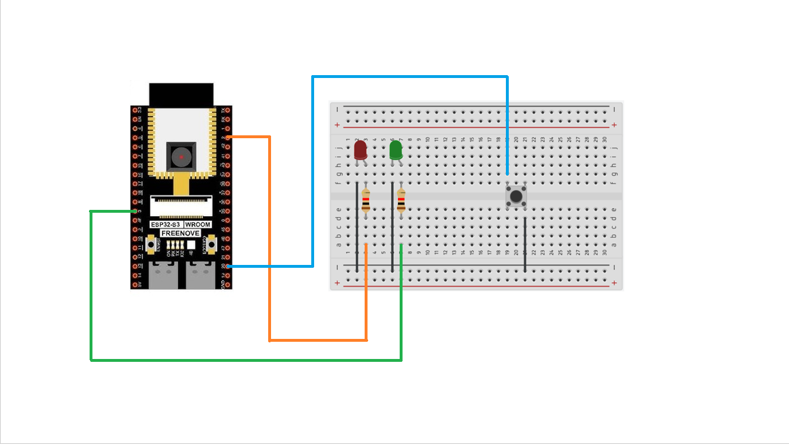
</p>

<br>

---

## Disposición en Planta

El montaje anterior se dispondrá en planta encima de un soporte unido a la cinta en la siguiente posición:

<br>

<p align="center">
		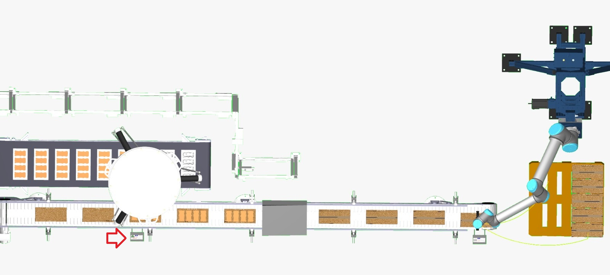
</p>

<br>

---

## Diagramas de comunicación MQTT

A continuación se describen los diagramas de comunicación MQTT de las interacciones indirectas presentes en la estación robotizada:

### Interacción sensor botón emergencia - estación
  Esta interacción es la relativa a la parada de emergencia de todo el sistema robótico implementado en la automatización. La ESP32 publicará en el topic “A1/sensor/boton/emergencia/cinta/cajas” el mensaje “PARAR” en caso de que se pulse el botón. A este topic se encontrarán suscritos todos los dispositivos electrónicos de la automatización (robot UR, delta, todas las ESP32-S3) y detendrán inmediatamente su ejecución en caso de recibir el mensaje “PARAR”.

<br>

  <p align="center">
		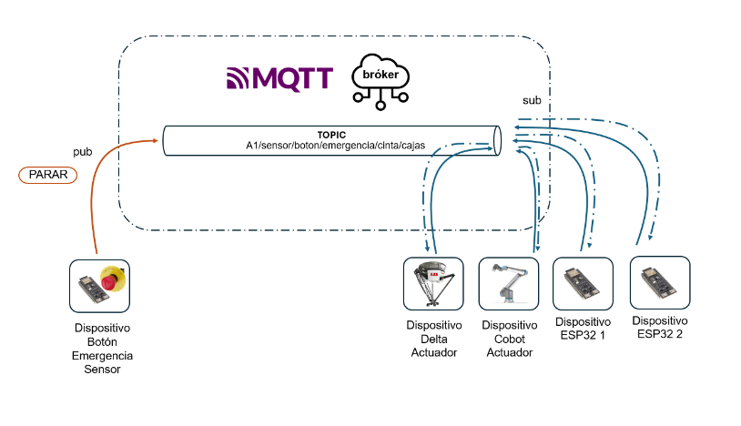
  </p>
  
<br>

### Interacción sensor cámara - base de datos
  La ESP32-S3 publica en el topic “A1/sensor/camara/qr/cinta/cajas” la información que contiene el código QR que lee. La publicación de la información del QR en el bróker simula la introducción de datos de forma automática en una base de datos que almacena los datos en relación a las cajas producidas.

<br>

  <p align="center">
		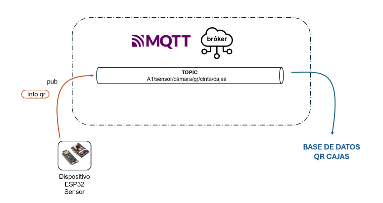
  </p>

<br>

---

## Funcionalidades Locales del Dispositivo

<br>

 El módulo incluye un semáforo, con 2 LEDs, uno verde y uno rojo. Esta funcionalidad no se contempla en las interacciones MQTT, ya que se comunica internamente mediante un buffer circular protegido. El semáforo LED indica cuando la cámara detecta un QR, haciendo que el LED verde se encienda y, por el contrario, si no lee QR, que se encienda el LED rojo. 

<br>

---

## Instrucciones para la Instalación e Integración

  ### 1. Instalar y configurar el entorno Arduino con las librerías especificadas, además de instalar el programa para la comunicación MQTT.
  
 <br>
 
 Para descargar las librerías también se puede hacer desde el library manager y board manager de Arduino IDE

 <br>

 <p align="center">
		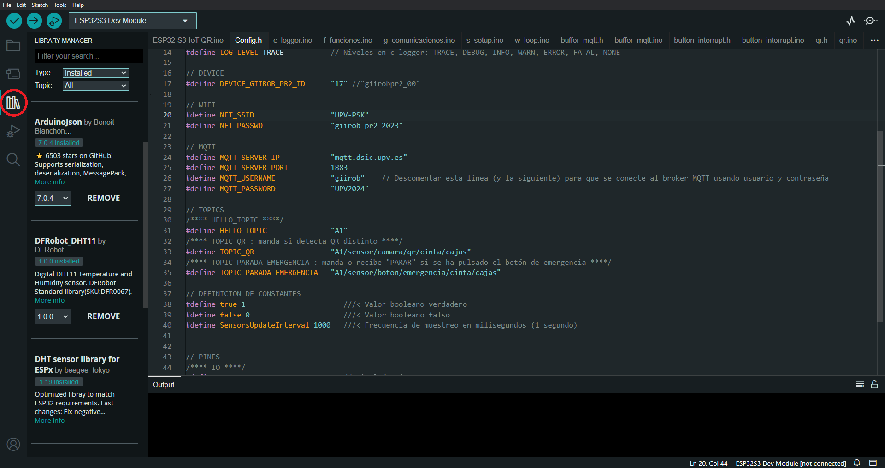
 </p>

 <br>

 <p align="center">
		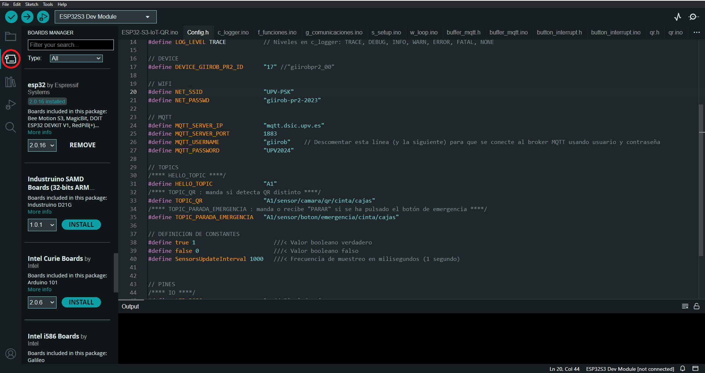
 </p>

 <br>

 Una vez descargadas las librerías necesarías para compilar el proyecto, seleccionar la placa en el cuadro de selección de placa, y cambiar a OPI PSRAM en Tools + PSRAM 

 <br>

 <p align="center">
		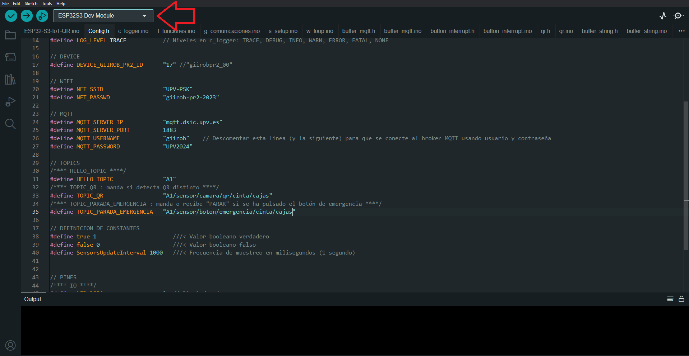
 </p>

 <br>

 <p align="center">
		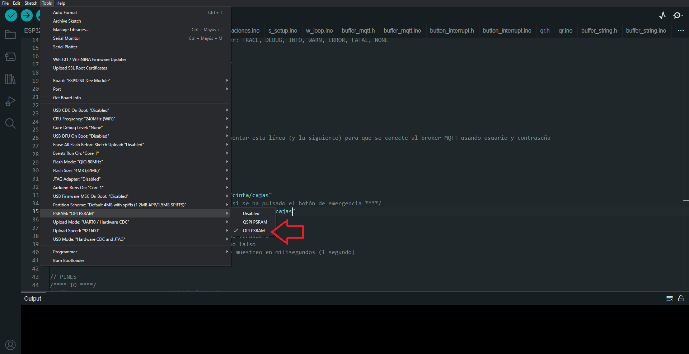
 </p>

 <br>
  
  ### 2. Instalar el código fuente descargando la carpeta zip de este repositorio o usando git clone.
  
  <br>
  
  #### Opción 1 
  Click en el boton _Download ZIP_ 

  <p align="center">
		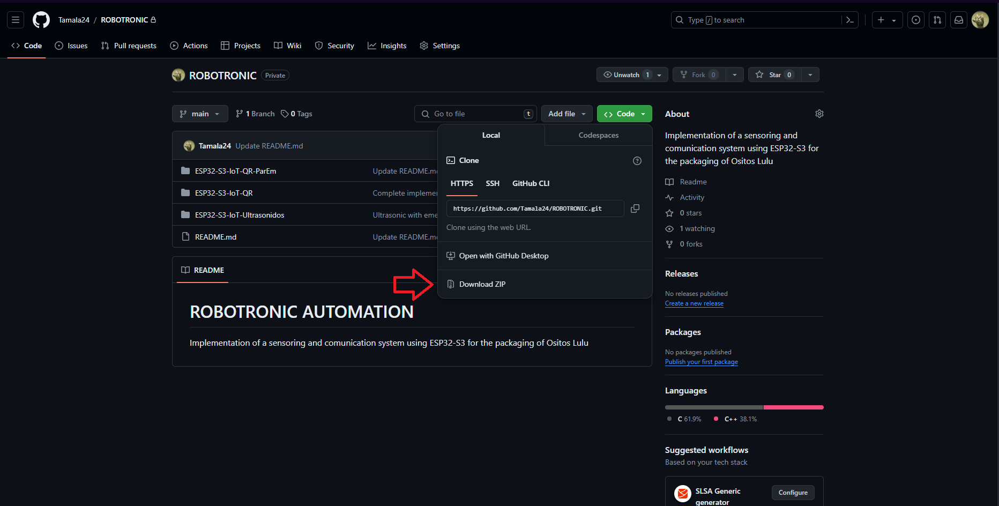
  </p>

  <br>

  #### Opción 2 
  Clonar el repositorio desde el terminal

  ```sh
  git clone myapp myapp.c -l wiringPi
  ```

  <br>
  
  ### 3. Modificar valores del código por los de la empresa.

  Para conectar la ESP32-S3 al wifi y al broker MQTT de la emmpresa, modificar las constantes NET_SSID, NET_PASSWD, MQTT_SERVER_IP, MQTT_USERNAME y MQTT_PASSWORD del archivo `Config.h` 
  
		/**
		 * @file  Config.h
		 * @brief Archivo de configuración del sistema
		 */
		#ifndef CONFIG_H
		#define CONFIG_H
	
  		...

      		// WIFI
		#define NET_SSID                  "UPV-PSK"
		#define NET_PASSWD                "giirob-pr2-2023"
		
		// MQTT
		#define MQTT_SERVER_IP            "mqtt.dsic.upv.es"
		#define MQTT_SERVER_PORT          1883
		#define MQTT_USERNAME             "giirob"    // Descomentar esta línea (y la siguiente) para que se conecte al broker MQTT usando usuario y contraseña
		#define MQTT_PASSWORD             "UPV2024"

  		...

    		#endif // CONFIG_H

<br> Si se desea modificar los topics por unos más acordes para su integración en la flota de la empresa modificar los valores de HELLO_TOPIC, TOPIC_PRESENCIA, TOPIC_COBOT y TOPIC_PARADA_EMERGENCIA del archivo `Config.h` 
  
		/**
		 * @file  Config.h
		 * @brief Archivo de configuración del sistema
		 */
		#ifndef CONFIG_H
		#define CONFIG_H
	
  		...

      		// TOPICS
		/**** HELLO_TOPIC ****/
		#define HELLO_TOPIC               "A1"
		/**** TOPIC_PRESENCIA : manda si detecta objeto "detect", si no, "libre" ****/
		#define TOPIC_PRESENCIA           "A1/sensor/presencia/cinta/cajas/final"
		/**** TOPIC_COBOT : recibe "operando" si el cobot está operando y "inactivo" si no ****/
		#define TOPIC_COBOT               "A1/actuador/led/cinta/cajas/final"
		/**** TOPIC_PARADA_EMERGENCIA : manda o recibe "PARAR" si se ha pulsado el botón de emergencia ****/
		#define TOPIC_PARADA_EMERGENCIA   "A1/sensor/boton/emergencia/cinta/cajas"

  		...

    		#endif // CONFIG_H
      		
  <br>
 
  ### 4. Montar el circuito como se indica en la [figura](#esquema-del-circuito).
  
  <br>
  
  ### 5. Conectar la placa al ordenador usando el puerto USB, compilar el proyecto y subir a la ESP32-S3.
  
 <br>

 Después de conectar la placa, seleccionar el puerto que aparezca en el seleccionador de puertos en Tools + Port  

 <br>

 <p align="center">
		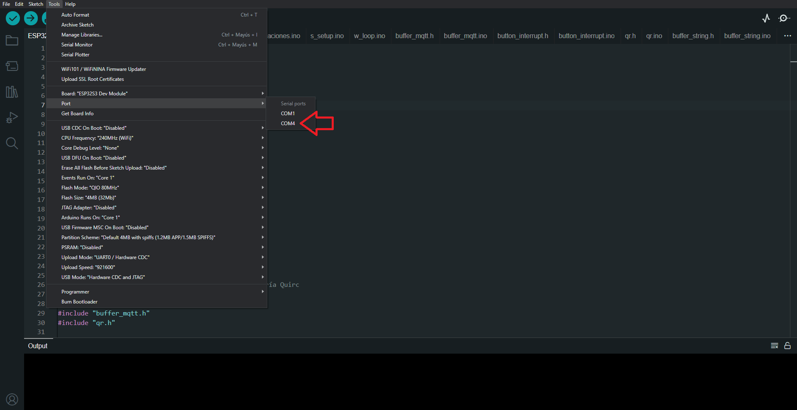
 </p>

 <br>

 Compilar primero el código y, si no aparece ningún error, ejecutar en la placa

 <p align="center">
		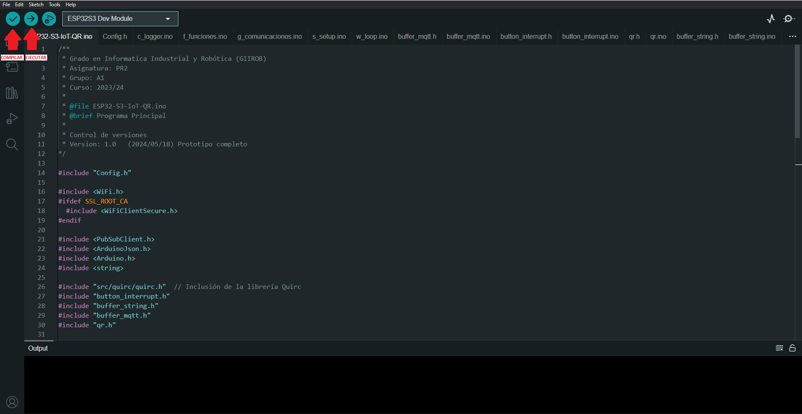
 </p>

 <br>
  
  ### 6. Desconectar la placa y situarla en su posición en [planta](#disposición-en-planta) conectada a una fuente de alimentación externa.
  
 <br>

