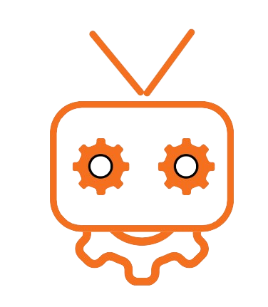
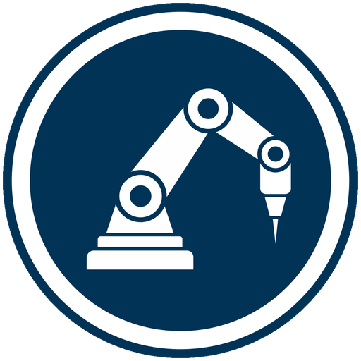

# Ositos Lulu Packaging

    

    <a href="https://tamala24.github.io/ROBOTRONIC_WEB/">WebPage</a>
 

                 
     <a href="https://youtu.be/lWvmaNaFN50?feature=shared">Promo Video</a>
 

 

---

## Contenidos
  - [Descripción](#descripción)
  - [Objetivos](#objetivos)
  - [Tecnologías](#tecnologías)
  - [Agradecimientos](#agradecimientos)

 

---

## Descripción
El trabajo ha consistido en el diseño e implementación de la automatización del proceso industrial de empaquetado de magdalenas de la empresa “Galletas Fontaneda”. Se ha llevado a cabo el desarrollo de una estrategia de comunicación entre los dispositivos tecnológicos, la elaboración de un sistema de recopilación de los datos generados por la empresa en una BBDD no relacional, así como la inclusión de estructuras de datos de programación avanzada.

 

---

## Objetivos
Este proyecto tiene como objetivo principal lograr una mejora tangible en la eficiencia y precisión de la línea de producción de la empresa contratante. Entre los beneficios derivados de la aplicación de la automatización encontramos una mayor flexibilidad de la línea de producción, mejora en la seguridad laboral y mayor capacidad de análisis y control.

 

---

## Tecnologías

Para la automatización utilizamos tecnologías propias de la industria 4.0 como los robots colaborativos, aplicaciones de modelado 3D como RoboDK, y elementos industriales como placas ESP32-S3.

    
    
    
    
    
    
    
    
    
    
    
    
    
    
    
        
 

 

---

## Agradecimientos

Finalmente queremos agradecer a nuestros profesores de la asignatura de PR2, Francisco Blanes, Joan Fons y Eduardo Vendrell, por las oportunidades que nos han brindado de conocer la industrial actual y por asesorarnos con sus conocimientos en la realización de este proyecto. 

